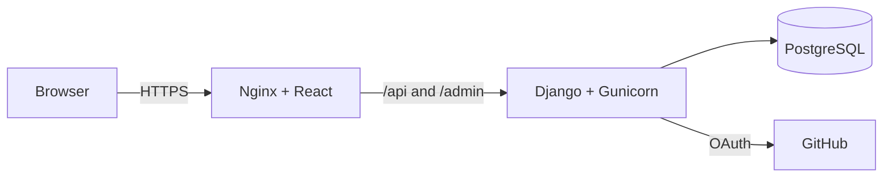

# Ahoum Sessions

<p align="center">
  A full-stack marketplace for discovering community-led sessions, reserving seats,
  and publishing sessions as an approved creator.
</p>

<p align="center">
  <a href="https://ahoum-sessions-abhishek-bhat.onrender.com"><strong>Live Demo — may take up to one minute to wake</strong></a>
  ·
  <a href="https://ahoum-api-abhishek-bhat.onrender.com/api/health/"><strong>API Health</strong></a>
</p>

<p align="center">
  
  
  
  
  
  
</p>

> [!IMPORTANT]
> **Deployment availability:** The API runs on Render's Free compute plan and
> automatically sleeps after **15 minutes without incoming traffic**. Its first request
> after sleeping starts it again and can take **about one minute** to complete. This is
> expected free-tier hosting behavior, not an application failure. The frontend now
> waits and retries during this cold start. Reviewers can wake the API first by opening
> the [API health endpoint](https://ahoum-api-abhishek-bhat.onrender.com/api/health/)
> and waiting for `{"status":"ok"}` before testing the application.

## Overview

Ahoum Sessions is a compact but production-minded marketplace. Visitors can browse
upcoming sessions without an account. GitHub users can sign in, reserve a seat, review
their bookings, and maintain their profile. Administrators can enroll trusted users as
creators, who can then publish and manage their own sessions.

The application uses one browser origin in production: Nginx serves the React build
and proxies `/api` and `/admin` to Django. Authentication uses short-lived JWT access
tokens in memory and a rotating refresh token stored in an HttpOnly cookie.

## Features

- Public catalog and session details
- GitHub OAuth with state validation and PKCE
- Secure JWT refresh-token rotation and logout
- Seat reservations with duplicate and capacity protection
- Creator-only publishing, editing, and cancellation
- Administrator-managed creator enrollment
- Responsive React interface with clear loading and error states
- PostgreSQL row locking for final-seat correctness
- Docker Compose development environment
- Render-ready frontend and backend containers

## Architecture



| Layer | Technology | Responsibility |
| --- | --- | --- |
| Frontend | React, TypeScript, Vite | Catalog, authentication, bookings, and creator studio |
| Edge | Nginx | Static assets, SPA fallback, and same-origin reverse proxy |
| API | Django, Django REST Framework | Domain rules, OAuth, JWTs, permissions, and validation |
| Database | PostgreSQL | Users, sessions, bookings, constraints, and transactional locking |
| Runtime | Docker, Gunicorn, Render | Reproducible builds and production hosting |

## Repository Structure

```text
ahoum-sessions-marketplace/
├── backend/                 Django API, domain logic, migrations, and tests
├── frontend/                React application and production Nginx image
├── infra/nginx/             Local reverse-proxy configuration
├── compose.yaml             Local multi-container environment
├── .env.example             Environment-variable template
├── DEBUGGING.md             Encountered issues and verified fixes
├── DECISIONS.md             Architecture and security decisions
└── PROMPT_LOG.md            Material AI-assisted work record
```

## Run Locally

### Prerequisites

- Docker Desktop with Linux containers enabled
- A GitHub OAuth App for sign-in

### 1. Configure the environment

Copy `.env.example` to `.env` and replace every `CHANGE_ME` value.

```powershell
Copy-Item .env.example .env
```

Configure the GitHub OAuth App callback URL as:

```text
http://localhost/api/auth/github/callback/
```

### 2. Start the application

```powershell
docker compose up --build
```

Open [http://localhost](http://localhost). Database migrations run automatically,
PostgreSQL data persists in the `postgres_data` volume, and the database is not
published to the host network.

### 3. Stop the application

```powershell
docker compose down
```

Add `--volumes` only when you intentionally want to remove the local database.

## Environment Variables

| Variable | Purpose |
| --- | --- |
| `DJANGO_SECRET_KEY` | Django cryptographic signing secret |
| `DJANGO_DEBUG` | Enables debug mode; keep `false` in production |
| `DJANGO_ALLOWED_HOSTS` | Comma-separated hostnames accepted by Django |
| `CSRF_TRUSTED_ORIGINS` | Comma-separated trusted browser origins, including scheme |
| `DATABASE_URL` | PostgreSQL connection URL |
| `GITHUB_CLIENT_ID` | GitHub OAuth App client ID |
| `GITHUB_CLIENT_SECRET` | GitHub OAuth App client secret; backend only |
| `GITHUB_REDIRECT_URI` | Registered GitHub OAuth callback URL |
| `OAUTH_SUCCESS_URL` | Frontend destination after successful authentication |
| `OAUTH_FAILURE_URL` | Frontend destination after failed authentication |
| `COOKIE_SECURE` | Restricts cookies to HTTPS when `true` |
| `DJANGO_SUPERUSER_*` | Optional initial administrator credentials |
| `BACKEND_URL` | Backend origin used by the production frontend proxy |

> [!IMPORTANT]
> Never commit `.env`. If a credential is exposed, rotate it at the provider and
> update the corresponding Render environment variable immediately.

## API Reference

| Method | Endpoint | Access | Description |
| --- | --- | --- | --- |
| `GET` | `/api/health/` | Public | Service health check |
| `GET` | `/api/sessions/` | Public | List upcoming published sessions |
| `GET` | `/api/sessions/:id/` | Public | Retrieve a published session |
| `GET`, `PATCH` | `/api/profile/` | User | Read or update the current profile |
| `POST` | `/api/sessions/:id/book/` | User | Reserve a seat |
| `GET` | `/api/bookings/` | User | List the current user's bookings |
| `GET`, `POST` | `/api/creator/sessions/` | Creator | List or publish owned sessions |
| `GET`, `PATCH`, `DELETE` | `/api/creator/sessions/:id/` | Creator | Manage an owned session |
| `GET` | `/api/auth/github/start/` | Public | Start GitHub OAuth |
| `GET` | `/api/auth/github/callback/` | Public | Complete GitHub OAuth |
| `POST` | `/api/auth/refresh/` | Cookie flow | Rotate tokens and restore a session |
| `POST` | `/api/auth/logout/` | Cookie flow | Revoke the refresh token |

Unsafe refresh and logout requests require Django's CSRF cookie/header pair.

## Correctness and Security

Booking and capacity-changing operations lock the relevant session row inside a
PostgreSQL transaction. Capacity, start time, and duplicate-booking rules are checked
after the lock is acquired. A conditional database uniqueness constraint provides a
second line of defense against duplicate active bookings.

Other security choices include:

- Refresh tokens are stored only in Secure, HttpOnly cookies in production.
- Access tokens remain in browser memory and are never written to local storage.
- OAuth validates state and uses a PKCE verifier.
- User roles cannot be changed through the profile API.
- Creator queries and mutations are restricted to the authenticated owner.
- The database remains private to the application network.

See [DECISIONS.md](DECISIONS.md) for the rationale behind the main design choices.

## Testing

Run the backend suite against the Compose PostgreSQL service:

```powershell
docker compose exec backend python manage.py test
```

The suite covers:

- a synchronized final-seat race that produces one success and one conflict;
- duplicate and post-start booking rejection;
- invalid JWT handling;
- user-to-creator authorization boundaries; and
- creator-to-another-creator ownership boundaries.

Build the frontend independently with:

```powershell
Set-Location frontend
npm.cmd ci
npm.cmd run build
```

SQLite is useful for quick development checks, but it is not proof of row-locking
behavior. The concurrency test is intended to run against PostgreSQL.

## Deploy on Render

Deploy the backend before the frontend.

### Backend Web Service

- Runtime: `Docker`
- Root directory: `backend`
- Dockerfile: `./Dockerfile`
- Health check: `/api/health/`
- Database: Render PostgreSQL internal URL in `DATABASE_URL`
- Production settings: HTTPS origins, secure cookies, and deployed hostnames

Verify the backend directly before continuing:

```text
https://ahoum-api-abhishek-bhat.onrender.com/api/health/
```

### Frontend Web Service

- Runtime: `Docker`
- Root directory: `frontend`
- Dockerfile: `./Dockerfile.render`
- `BACKEND_URL=https://ahoum-api-abhishek-bhat.onrender.com`

Do not add a trailing slash to `BACKEND_URL`. After changing an environment variable,
redeploy the frontend and verify the proxied health endpoint:

```text
https://ahoum-sessions-abhishek-bhat.onrender.com/api/health/
```

For production OAuth, the GitHub OAuth App callback must exactly match:

```text
https://ahoum-sessions-abhishek-bhat.onrender.com/api/auth/github/callback/
```

## Known Limitations

The compact scope intentionally omits attendee cancellation, email notifications,
search and pagination, audit logs, rate limiting, automated CI, and end-to-end browser
tests. These are natural next steps for a larger production release.

---

<p align="center">
  Built as a focused demonstration of full-stack architecture, transactional
  correctness, and secure OAuth integration.
</p>
